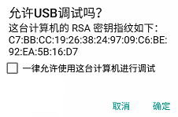
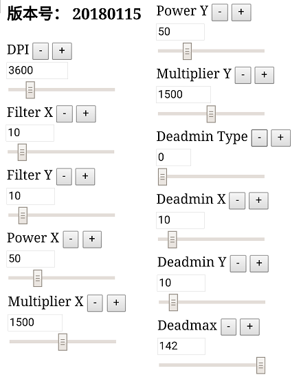
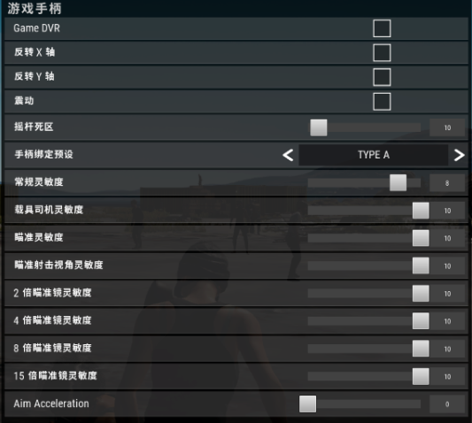

[TOC]
# **硬件介绍**
K4是配合N100/N100 Pro使用的一款专用HUB。通过K4，N100/N100 Pro可以接收HID外设的数据，比如：键盘、鼠标、HID手柄、HID大摇杆等。

# **连接方式**
### **Nintendo Switch**
先把K4连上N100，再把键鼠连上K4，最后把N100连上NS主机
### **PS4**
先把K4连上N100，再把键鼠及PS4原装手柄连上K4，最后把N100连上PS4主机
### **Xbox One**
先把K4连上N100，再把键鼠及Xbox One原装手柄连上K4，最后把N100连上Xbox One主机

# **使用建议**
建议不熟悉N100高级功能的玩家先使用官方或其他玩家已配置好的`data.bin`，以免在功能配置耽误太多时间。

# **功能描述**
### **HID按键映射**
*完整描述请访问[N100](N100.html)*
##### **设置实例**
将`鼠标左键`映射到Xbox one手柄的`右扳机`上
1. 同时按下`西瓜键` + `B`并松开，进入键位映射功能配置模式
2. 按一下`鼠标左键`
3. 按一下`右扳机`
4. 按一下`西瓜键`键，退出配置模式

### **HID一键连招**
*完整描述请访问[N100](N100.html)*
##### **设置实例**
通过键盘的`R键`实现手柄上长按`B`的效果
1. 同时按下`西瓜键` + `Y`并松开，进入键位映射功能配置模式
2. 长按`B`，触发换枪操作
3. 按一下`西瓜键`
4. 按一下`R键`键，退出配置模式

### **鼠标参数调整**
N100支持实时调整鼠标参数，但用户需要先准备一台开启了USB调试功能的安卓手机，并安装最新版本的Chrome浏览器。
##### **USB调试**
将安卓手机通过数据线连上K4，安卓手机上会弹出授权窗口，点击确定

##### **自动打开网页**
安卓手机会自动打开一个网页，如下图：

##### **参数解释**
* DPI：填入所用鼠标的DPI *当换用不同DPI的鼠标时，可以将此值进行相应调整，以获取相同体验*
* Filter X：X轴平滑度，可以直接设置为10，一般不用调整
* Filter Y：Y轴平滑度，可以直接设置为10，一般不用调整
* Power X：X轴非线性灵敏度，此值越高，高速响应越灵敏
* Multiplier X：X轴线性灵敏度，此值越高，响应越灵敏，对低速移动及高速移动具有同等缩放比例效果
* Power Y：Y轴非线性灵敏度，一般情况下，可与Power X相同
* Multiplier Y：Y轴线性灵敏度，一般情况下，可与Multiplier X相同
* Deadmin Type：死区类型
* Deadmin X：X轴内死区
* Deadmax Y：Y轴内死区
* Deadmax：外死区，默认142，一般不用调整

### **鼠标参数调整实例**
本实例以Xbox One主机下PUBG（吃鸡）游戏为例
##### **准备工作**
1. 了解所用鼠标的DPI，本实例所用鼠标为G502，DPI设置为3600
2. 进入PUBG的游戏设置界面，关闭震动、关闭瞄准加速（Aim Acceleration）、将各项灵敏度调整至最高（酌情降低个别项目的灵敏度，以提供后续调整空间）

##### **参数调整**
1. 设置DPI为3600
2. 调整Deadmin X及Deadmin Y，以缓缓移动鼠标时，瞄准准星也能缓缓变化为佳
3. 尝试用鼠标左右、上下、斜上斜下直线滑动，如果瞄准准星无法直线移动，则改变Deadmin Type
4. 调整Power X及Multiplier X，将Multiplier X设置为1000，调整Power X，以低速移动及高速移动鼠标时视角变化较自然为佳，然后调整Multiplier X，获得比较合手的灵敏度。
5. 微调Power X及Multiplier X，（玄学调整，自由发挥）
6. 调整Power Y及Multiplier Y，同Power X及Multiplier X
7. 拔掉手机，保存参数

### **已配置参数**
* [XB1_PUBG下载](K4/K4_XB1_PUBG_by_le062.zip)  [演示视频](http://v.youku.com/v_show/id_XMzU0OTI4MTAzMg==.html)
