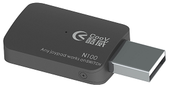
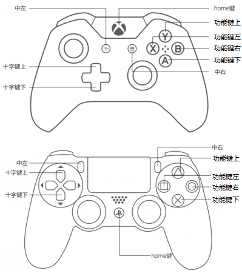
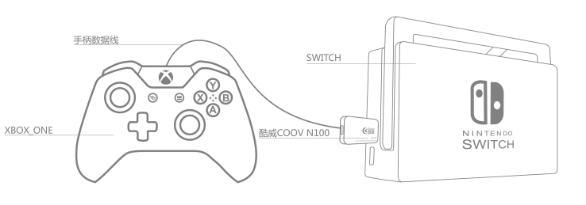
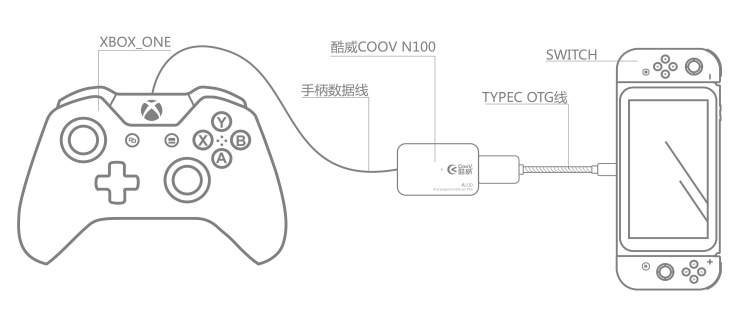

[TOC]
# **特别建议**
请升级至最新5.x固件，以获得完整功能
* [V5.5](N100/COOV N100  V5.5 20180327.zip)

产品BUG反馈：[论坛](https://gamepad-converter.mycoov.com/viewforum.php?f=4)

# **硬件介绍**
N100是COOV转换器系列的基本形态，集成了一个USB A公与一个USB A母。可将互不兼容的主机与外设互相连接使用。


### **键位描述图**


### **已支持主机 (固件版本5.5)**
* Nintendo Switch
* PS4 全系列  
* Xbox One 全系列
* Windows 10
* Windows 7 （需专用固件[V5.5B](N100/COOV N100  V5.5 20180327.zip)）
* 安卓系统 （部分安卓定制系统，精简了xinput驱动，无法即插即用，此情况下可配合[usb/bt joystick](https://gamepad-converter.mycoov.com/viewtopic.php?f=4&p=23)解决）
* Linux系统

### **已支持外设**
* NS Pro手柄
* PS4手柄及原装接收器
* Xbox One手柄
* PS3手柄 *（连接PS3手柄后，可能需要先多按几次PS键）*
* XBOX360有线手柄
* 其他第三方兼容手柄
* 键鼠、PC手柄、PC格斗摇杆等HID外设 *（配合 [K4](K4.html)）*

# **快速上手**
### **N100 NS主机客厅模式**
SWITCH主机放置在底座情形下，将N100插入SWITCH底座USB口，其他手柄通过USB线连入N100末端即可正常工作。


### **N100 NS主机移动模式**
将Type-C OTG线插入SWITCH充电口，N100插入此TYPEC线末端，其他手柄通过USB线连入N100末端即可正常工作。


### **N100 PS4主机**
将PS4原装手柄连入N100末端，N100插入PS4主机。若想使用其他外设，请配合HUB。

### **N100 Xbox One主机**
将Xbox One原装手柄连入N100末端，N100插入Xbox One主机。若想使用其他外设，请配合HUB。

# **功能介绍**
### **固件更新**
N100通过模拟U盘的方式进行固件更新，新固件可以在[官网](http://www.mycoov.com/)、QQ群(486965394)、[Wiki](https://gamepad-converter.github.io/)中获得。用户下载新版本固件压缩包后，将其中的`firmware.bin`复制到N100 U盘中，选择覆盖即可。更新成功后，N100绿灯亮起，并自动重新连接电脑。*（某些情况下，电脑会提示写入失败，但实际已完成更新）*
在最新出厂的N100上，我们在U盘中增加了`info.txt`文档，用户可以很方便的从中获取版本信息，如下：
```
Product:N100                  
Product ID:D0152900           
Version:3.4                   
```

### **配置更新**
在模拟U盘中，还有一个`data.bin`文件，这个文件存储着所有用户自定义参数。出厂状态下所有参数为默认值，当用户进入高级功能进行配置后，相关配置会被保存与此文件中。*（注意：从V5.0版本开始，配置文件与之前版本不再兼容）*

用户可以刷入官方提供的各种配置文件来快速提升操控体验，也可以将自己的配置文件分享给其他转换器用户。

### **连接NS主机**
* 掌机模式：
  1. 准备Type-C OTG转接头或线材
  2. 将NS主机、OTG转接头或线材、N100及手柄依次连接
  3. 若非1.x版本固件，还需将NS主机中`Pro Controller Wired Communication`选项置为`ON`，并重启NS
* 底座模式：
  1. 将底座、N100及手柄依次连接
  2. 若非1.x版本固件，还需将NS主机中`Pro Controller Wired Communication`选项置为`ON`，并重启NS

### **连接PS4主机**
1. 更新N100固件至3.x或更高版本
2. 准备一个USB HUB和一个PS4 **原装** 引导手柄
3. 把HUB连接到N100母口，再把引导手柄连接到HUB上
4. 把其他想转换的手柄连接到HUB上
5. 把N100连接至PS4主机 *（较早版本N100无法直接插入PS4主机，可以按照以下方法解决）*
    * 方法一：使用USB A公转A母延长线
    * 方法二：准备一把小号十字螺丝刀，卸掉N100两侧的螺丝，然后取下USB公头一侧的小挡板，将挡板旋转180°，再套入USB公头并卡紧，上螺丝。

### **连接Xbox One主机**
1. 更新N100固件至3.x或更高版本
2. 准备一个USB HUB和一个Xbox ONE **原装** 引导手柄
3. 把HUB连接到N100母口，再把引导手柄连接到HUB上
4. 把其他想转换的手柄连接到HUB上
5. 把N100连接至Xbox ONE主机

# **高级转换功能**
### **线性控制（默认开启）**
线性控制是用来关闭或开启手柄摇杆和扳机的线性响应，以实现更短的键程和更快的响应速度

##### **关闭线性**
1. 同时按下`HOME` + `功能键下`并松开，进入线性控制功能配置模式
2. 按住需要关闭线性功能的扳机，或拨动需要关闭线性功能的摇杆，再按一下`中左键`，即可关闭对应扳机或摇杆的线性功能
3. 按一下`HOME`键，退出配置模式

##### **开启线性**
1. 同时按下`HOME` + `功能键下`并松开，进入线性控制功能配置模式
2. 按住需要开启线性功能的扳机，或拨动需要开启线性功能的摇杆，再按一下`中右键`，即可开启对应扳机或摇杆的线性功能
3. 按一下`HOME`键，退出配置模式

##### **开启所有键位的线性**
1. 同时按下`HOME` + `功能键下`并松开，进入线性控制功能配置模式
2. 按住`HOME`键3秒钟，会自动开启所有线性功能，并自动退出配置模式

##### **线性自定义**
在此功能中，可以调整左右摇杆及左右扳机的线性级别，各有7个档位，键程比例依次为：100%、 80%、 66%、 50%、 25%、 12%、 1%。其中100%键程等同于线性开启状态，1%键程等同于线性关闭。
 1. 同时按下`HOME` + `功能键下`并松开，进入线性控制功能配置模式
 2. 按住需要调整线性功能的扳机摇杆，或拨动需要开启线性功能的摇杆，不要松开
 3. 按一下`十字键上`，即可提高线性级别
 4. 按一下`十字键下`，即可降低线性级别
 5. 按一下`HOME`键，退出配置模式

##### **支持的键位**
两个摇杆及两个扳机

### **键位映射**
键位映射是将一个按键映射到另一个不同按键上，可实现多个按键相同功能或多个按键相互交换的功能。

##### **设置**
1. 同时按下`HOME` + `功能键右`并松开，进入键位映射功能配置模式
2. 按一下需要映射的按键
3. 按一下目标映射的按键
4. 按一下`HOME`键，退出配置模式
比如先按`功能键左`，再按`功能键右`，即使得`功能键左`具有`功能键右`功能。

##### **单个清除**
1. 同时按下`HOME` + `功能键右`并松开，进入键位映射功能配置模式
2. 按一下需要清除映射的按键
3. 再按一下需要清除映射的按键
4. 按一下`HOME`键，退出配置模式
比如先按`功能键左`，再按一次`功能键左`，即使得`功能键左`恢复默认功能。

##### **全部清除**
1. 同时按下`HOME` + `功能键右`并松开，进入键位映射功能配置模式
2. 按住`HOME`键3秒钟，会自动清除所有已配置的键位映射，并自动退出配置模式

##### **实例1**
1. 先将`功能键左`映射为`功能键右`，再将`功能键右`映射为`功能键左`，即可实现两键交换（在键位映射模式下，实现方法为按`功能键左` `功能键右` `功能键右` `功能键左`）
2. 将`功能键左`映射为`功能键右`，再将`功能键右`映射为`功能键下`，再将`功能键下`映射为`功能键左`，即可实现三键交换 （在键位映射模式下，实现方法为按`功能键左` `功能键右` `功能键右` `功能键下` `功能键下` `功能键左`）
3. 以此类推

##### **实例2**
1. **此项配置过程中，双击`HOME`无法模拟成其他按键，所以需要通过ps4手柄或pro手柄进行此项操作**
2. 进入键位映射功能配置模式后，依次按下`中左键` `触摸板键/截图键` `触摸板键/截图键` `中左键`，然后按`HOME`退出

##### **支持的键位**
* 基本模式：除`HOME`键及`摇杆`外的所有按键
* 配合K4 HUB：可以将HID外设映射到手柄上。详情请点击[K4](K4.html)

### **连发（默认关闭）**
连发控制是用来将选定的按键配置为连发模式，当按键处于连发模式下，该键被按下后，就会以一定频率模拟按下-松开-按下-松开事件，连发频率可调

##### **开启连发**
1. 同时按下`HOME` + `功能键左`并松开，进入连发功能配置模式
2. 按住需要开启连发功能的按键，再按一下`中右键`，即可开启对应按键的连发功能
3. 按一下`HOME`键，退出配置模式

##### **关闭连发**
1. 同时按下`HOME` + `功能键左`并松开，进入连发功能配置模式
2. 按住需要关闭连发功能的按键，再按一下`中左键`，即可关闭对应按键的连发功能
3. 按一下`HOME`键，退出配置模式

##### **清除所有连发**
1. 同时按下`HOME` + `功能键左`并松开，进入连发功能配置模式
2. 按住`HOME`3秒钟，会自动清除所有已配置的连发功能，并自动退出配置模式

##### **调整连发频率（基本模式）**
1. 同时按下`HOME` + `功能键左`并松开，进入连发功能配置模式
2. 按一下`十字键上`，即可加大连发频率
3. 按一下`十字键下`，即可降低连发频率
4. 按一下`HOME`键，退出配置模式

##### **调整连发频率（自定义模式）**
在自定义模式中，用户可以设置两个参数：按下时间`a`毫秒与松开时间`b`毫秒。当连发启动时，按键会自动被按下`a`毫秒，然后松开`b`毫秒，然后再次按下`a`毫秒，循环往复。`a`与`b`的值应大于`4`，小于`252`。

1. 确定你想设置的值，比如`a`为128，`b`为164
2. 同时按下`HOME` + `功能键左`并松开，进入连发功能配置模式
3. 按住`中左键`与`中右键`，且不要松开
4. 设置`a`值：按一下`功能键上`，`a`值增加100；按两下`功能键右`，`a`值增加20；按八下`功能键下`，`a`值增加8。合计128
5. 设置`b`值：按一下`十字键上`，`b`值增加100；按六下`十字键右`，`b`值增加60；按四下`十字键下`，`b`值增加4。合计164
6. 松开`中左键`与`中右键`，配置正常的话，会闪烁绿灯。
7. 如果在步骤2至步骤6的过程中，配置错误，可以从步骤2开始重新配置。`a`值与`b`值也可以单独设置。
8. 按一下`HOME`键，退出配置模式

##### **支持的键位**
除`HOME`、`中左键`、`中右键`及摇杆外的所有按键

### **一键连招**
此功能用于记录连续动作，并设置成通过某个按键触发，设置完成后，可通过单个按键处罚这一组连续动作。使用场景：一键释放格斗游戏大招、无限循环刷金币/声望（配合按键锁功能）等等。

##### **使用限制**
最多可记录10组，单组最短可录制2.5秒，单组最长录制可以超过一小时。另外支持动态级联，当录制数据超过单组长度时，会自动使用空闲组级联，此模式下，即使连续转动摇杆（线性开启），也可以保证录制25秒。
**如果需要录制一组或多组超长动作，强烈建议先关闭摇杆及扳机的线性功能！**

##### **设置**
1. 同时按下`HOME`+`功能键上`并松开，进入一键连招功能配置模式
2. 进行连招操作，设备会自动将连招记录（此操作不会被屏蔽）
3. 按一下`HOME`键，结束录制
4. 按一下用于触发此连招的按键。设置成功后，会自动退出配置模式（也可以通过再按一次`HOME`键退出）

##### **单个清除**
 *（V3.4及之前版本，存在BUG，无法单个清除，请更新最新固件）*
1. 同时按下`HOME`+`功能键上`并松开，进入一键连招功能配置模式
2. 按一下`HOME`键，不进行录制
3. 按一下之前配置成触发连招的按键。清除成功后，会自动退出配置模式（也可以通过再按一次`HOME`键退出）

##### **全部清除**
1. 同时按下`HOME`+`功能键上`并松开，进入一键连招功能配置模式
2. 按住`HOME`键3秒钟，会自动清除所有已配置的一键连招，并自动退出配置模式

##### **支持的键位**
* 基本模式：除`HOME`键外的所有按键
* 配合K4 HUB：可以用键鼠按键触发连招。详情请点击[K4](K4.html)

### **按键锁/一键无限循环（默认关闭）**
按键锁可以对选定的按键加锁。 **当按下一个加锁按键，按键被会锁定在按下状态，直至此按键被再次按下并松开。** 此功能可以实现无限长按压，也可以配合连发、一键连招实现无限自动操作。

##### **开启按键的按键锁功能**
 *（请不要在有按键被锁定的状态下进入配置模式）*
1. 同时按下`HOME` + `十字键上`并松开，进入按键锁功能配置模式
2. 按住需要开启按键锁功能的按键，再按一下`中右键`，即可开启对应按键的按键锁功能
3. 按一下`HOME`键，退出配置模式

##### **关闭按键的按键锁功能**
 *（请不要在有按键被锁定的状态下进入配置模式）*
1. 同时按下`HOME` + `十字键上`并松开，进入按键锁功能配置模式
2. 按住需要关闭按键锁功能的按键，再按一下`中左键`，即可关闭对应按键的按键锁功能
3. 按一下`HOME`键，退出配置模式

##### **关闭所有按键的按键锁功能**
 *（请不要在有按键被锁定的状态下进入配置模式）*
1. 同时按下`HOME` + `十字键上`并松开，进入按键锁功能配置模式
2. 按住`HOME`3秒钟，会自动清除所有已配置的按键锁功能，并自动退出配置模式

##### **锁定按键**
按一下已开启按键锁功能的按键，此后按键被锁定

##### **解锁按键**
按一下已锁定的按键并松开，此后按键被解除锁定。**同时会立刻中止由此按键触发的连招循环**

##### **支持的键位**
除`HOME`、`中左键`、`中右键`及`摇杆`外的所有按键

### **手柄震动开关及力度调整功能**
1. 同时按下`HOME`键 + `中左键`并松开，进入震动配置模式
2. 按一下`十字方向键上`，提高震动力度
3. 按一下`十字方向键下`，降低震动力度（降到最低即关闭震动）
4. 按一下`HOME`键，退出配置模式

*DS3手柄无法调整震动强度，只有开关功能*

### **校准功能**

##### **校准**
校准功能，可以在不增大死区的前提下，解决部分手柄出现的摇杆漂移问题。
1. 同时按下`HOME` + `中右键`并松开，进入校准配置模式
2. 尝试转动两个摇杆，直到手柄停止震动
3. 停止震动后，先松开两个摇杆，再按一下`HOME`键
4. 等待1秒后，自动退出校准模式，转换器亮绿灯表示校准成功，红灯表示校准失败

##### **清除校准数据**
1. 同时按下`HOME` + `中右键`并松开，进入校准配置模式
2. 按下`HOME`键并保持3秒，会清除所有校准参数，并退出配置模式

##### **使用建议**
大部分原装手柄无需校准，如果出现摇杆漂移，再进行校准。

### **四组独立配置的切换**
V5.0固件可以同时保存4组配置，启动时默认载入第一组配置。各组之间的配置互不干涉，可以使用`HOME` + `LB`或`HOME` + `RB`快速切换。切换时，会有LED(红、绿、蓝、黄)及震动提示

##### **使用场景**
1. 第一组配置功能默认，只使用了手柄转换功能
2. 第二组针对喷射战士2，开启了连发功能，开启了一键大招功能
3. 第三组针对异度之刃2，开启的一键连招和按键锁，用于刷声望等等
4. 其他游戏

### **其他事项**
1. 在高级功能配置过程中，每次有效操作都会触发一次手柄震动
2. 连发频率调整将以红色LED灯闪烁频率予以提示
3. 默认通过双击`HOME`键实现对`Capture`（NS手柄）、`触摸板`（DS4手柄）的模拟

# **其他信息**
### **如何快速确认手柄是否被支持**
* 尝试进入[高级功能](../软件功能/converter_advanced.html)，观察手柄是否会震动已经N100指示灯是否有反应。比如：同时按下`Home`+`中左`键，进入震动强度调整功能，再按几下方向键上和方向键下，如果手柄被支持，此时该手柄会震动，N100指示灯会闪烁。
### **如何恢复出厂设置**
* 如无特殊需求，建议直接下载最新固件，并刷入其中的`firmware.bin`和`data.bin（出厂版）`

# **固件**
### **下载**
* [V5.5](N100/COOV N100  V5.5 20180327.zip)
* [V5.4](N100/COOV N100 & N200 V5.4 20180306.zip)
* [V4.1002](N100/COOV N100 & N200 V4.1002 20180108.zip)
* [V4.0](N100/COOV N100 & N200 V4.0 20180104.zip)
* [V3.4002](N100/COOV N100 & N200 V3.4002 20171226.zip)
* [V3.4](N100/COOV N100 & N200 V3.4 20171212.zip)
* [V3.2](N100/COOV N100 V3.2 20171205.zip)
* [V2.4](N100/COOV N100 V2.4 20170909.zip)
* [V1.6](N100/COOV N100 V1.6 20171201.zip)
### **变更日志**
```
2018年3月27日（V5.5）
1. 新增支持Win10系统（Xinput）, Win7 / Vista用户请使用专用固件
2. 新增支持安卓系统（Xinput）
3. 取消X1手柄的连接自动震动
4. 降低高级功能配置时的震动强度
5. 新增支持pro手柄的摇杆校准功能
6. 修复某些情况下HID数据被忽略的BUG
7. 修复Xbox One S手柄无法作为引导手柄使用的BUG

2018年3月13日（V5.4302）
1. 支持Windows系统（Xinput）
2. 优化对Android系统的支持（Xinput）
3. 不再使X1手柄在连接后自动震动
4. 降低高级功能配置时的震动强度（原有高强度震动可能导致在掌机模式下供电不足）
5. 支持pro手柄的摇杆校准功能

2018年3月6日（V5.4）
修复某些版本K4上键鼠无法使用的问题

2018年2月15日（V5.3）
修复NS主机震动功能缺失的问题

2018年2月5日（V5.0）
1. 支持四组独立配置的实时切换：V5.0固件可以同时保存4组配置，启动时默认载入第一组配置。各组之间的配置互不干涉，可以使用HOME + LB或HOME + RB快速切换。切换时，会有LED(红、绿、蓝、黄)及震动提示
2. 支持安卓系统（手机、平板、电视盒）
3. 支持通过关闭线性来提升连招的录制时间
4. 增加线性级别（键程）自定义： 调整左右摇杆及左右扳机的线性级别，各有7个档位，键程比例依次为：100%、 80%、 66%、 50%、 25%、 12%、 1%。其中100%键程等同于线性开启状态，1%键程等同于线性关闭。
5. 一键连招： 最多可记录10组，单组最短可录制2.5秒，单组最长录制可以超过一小时。另外支持多组级联，当录制数据超过单组长度时，会自动使用空闲组级联，此模式下，即使连续转动摇杆（线性开启），也可连续录制25秒。
6. 使用按键锁+连招功能实现无限循环时，解除按键锁定会立刻中止循环
7. 优化pro手柄的震动支持

2018年1月4日（V4.0）
1. 增加安卓APP的支持，目前可用于调整鼠标转换参数
2. 增加按键锁功能，用于实现无限长按压，也可以配合连发、一键连招实现无限自动操作
3. 一键连招优化：支持通过键鼠按键触发
4. 一键连招优化：完善指示灯提示
5. 按键映射优化：支持触摸键（DS4）/截图键（PRO）
6. 按键映射优化：支持手柄映射的单个清除
7. 连发优化：频率档位从5提升到19，最小间隔25ms。最大间隔500ms
8. DS4手柄：手柄连接转换器后，会亮起弱紫色

2017年12月12日（V3.4）
1. 在按键映射配置过程中，过滤掉鼠标移动误触
2. PRO手柄的支持优化，主要解决一些输入冲突
3. 修复XB1手柄 LT RT数据异常的情况
4. 修复一键连招中触发键与连招干涉的问题
5. 修复一个数据处理逻辑问题

2017年12月8日（V3.3）
1. 修复X1主机下LT/RT异常
2. 修复X1主机下震动异常

2017年11月30日（V3.1）
1. 支持XBOX ONE主机，需配合原装手柄引导
2. 支持PS4主机，需配合原装手柄引导
3. 支持连接键盘、鼠标、HID手柄、HID格斗摇杆操控，需配合COOV HUB K4
4. NS模式摇杆顺滑及平整性优化
5. 多个手柄连接状态下的优化
6. 支持将手柄按键映射到摇杆上

2017年9月9日（V2.04）：
1. 稳定性修复，解决异常触发的问题
2. 支持同时接入多个转换器
3. 支持接入PRO手柄
4. 支持Mad Catz PS4手柄及PS4无线接收器
5. 默认状态下的震动强度调整为低，而非关闭

2017年8月20日：
1. 扳机键连发及映射功能修复
2. 2.x版本配置模式震动提示修复
3. 增加震动开关及力度调整功能

2017年8月15日：
1. 震动功能稳定性修复
2. 摇杆优化

2017年8月10日：
1. 支持震动
2. 支持体感（仅限连接PS4手柄）
3. 支持部分带有主机自动识别功能的手柄，比如BTP-BD2E
4. 震动功能稳定性修复

注意：请将"Pro Controller Wired Communication" 设置为ON

2017年8月2日：
1. 增加摇杆校准功能
2. 增加一款盗版PS4手柄的支持

2017年7月21日：
1. 增加对Xbox one精英版手柄的支持
2. 增加针对摇杆反弹抖动的过滤机制
```
