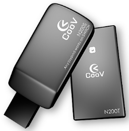
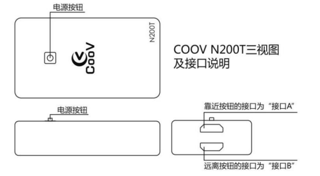

[TOC]
# **特别建议**
请升级至最新5.x固件，以获得完整功能
* [V5.4](N100/COOV N100 & N200 V5.4 20180306.zip)

产品BUG反馈：[论坛](https://gamepad-converter.mycoov.com/viewforum.php?f=5)

# 硬件介绍
N200由N200S、N200T两部分组成，其中N200T是以N100为基础，扩展了六轴和无线功能；N200S是一个无线收发器，用于连接主机与N200T。


# N200T NS主机无线模式快速上手

1. 点击下载最新固件[V3.4](N100/COOV N100 & N200 V3.4 20171212.zip)，解压，进入N200T文件夹
2. 确认N200T出于关机状态，且不要连手柄，把N200T的`接口A`连接电脑，我的电脑中会出现一个U盘，将N200T文件夹下的`firmware.bin`复制到N200T U盘中，选择覆盖即可。U盘会自动弹出，并重新连接，更新成功。
3. 在NS主机系统设置中，把`Pro Controller Wired Communication`选项置为`ON`，并 **重启** NS主机
4. 把N200S连上NS主机
5. 把N200T连上手柄，开机使用

# 使用形态

### N200T独立使用
当N200T单独使用时，可以具备[N100](./N100.html)的所有功能。其中接口A用于连接主机，接口B用于连接手柄。此模式的使用方式与[N100](./N100.html)相同，但连接前务必先 **关机**。

##### N200T已支持主机
* NS主机
* PS4主机 *（3.0或更高版本固件）*
* Xbox One主机 *（3.0或更高版本固件）*

##### N200T已支持外设
* NS Pro手柄
* PS4手柄及原装接收器
* Xbox One手柄
* PS3手柄 *（连接PS3手柄后，可能需要先多按几次PS键）*
* XBOX360有线手柄
* 其他第三方兼容手柄
* 键鼠、PC手柄、PC格斗摇杆等HID外设 *（配合 [K4](K4.html)）*

### N200S配合N200T使用
##### N200S已支持主机
1. NS主机
2. PS4主机 *（需在N200S上连接原装引导手柄，否则在连接8分钟左右自动断线）*

##### N200S已支持外设
1. PS4原装系列手柄
2. Xbox ONE原装系列手柄

# 功能介绍

### N200T开关机
* 长按1秒开关机
* 断开连接 **五分钟** 后自动关机
* 手柄闲置不动 **十五分钟** 后自动关机

### N200T电量提示
* 低电量状态闪烁红灯
* 满电状态闪烁绿灯 *（部分批次为蓝灯）*
* 其他状态闪烁白灯

### 基本转换功能
[链接](../软件功能/converter_basic.html)
### 高级转换功能
[链接](../软件功能/converter_advanced.html)

### 固件更新
N200S、N200T通过模拟U盘的方式进行固件更新，新固件可以在[官网](http://www.mycoov.com/)、QQ群(486965394)、[Wiki](https://gamepad-converter.github.io/)中获得。

##### N200T固件更新
1. 将N200T关机，断开`接口B`，再把`接口A`连到电脑上
2. 把新固件压缩包中`N200T固件`目录下的`firmware.bin`复制到N200T U盘中，选择覆盖即可。更新成功后，N200T绿灯 *（部分批次为蓝灯）* 亮起，并自动重新连接电脑。*（某些情况下，电脑会提示写入失败，但实际已完成更新）*

##### N200S固件更新
1. 将与其配对过的N200T关机
2. 断开与N200S相连的手柄，再连接电脑。等待5~10秒。 *（如果出现不认盘的情况，请确认N200T已关机，或者换其他电脑或安卓手机尝试）*
3. 把新固件压缩包中`N200S固件`目录下的`firmware.bin`复制到N200S U盘中，选择覆盖即可。更新成功后，N200S自动重新连接电脑。*（某些情况下，电脑会提示写入失败，但实际已完成更新）*

##### 查看N200T及N200S版本号
U盘有一份`info.txt`文档，用户可以很方便的从中获取版本信息，如下：
```
Product:N200S                 
Product ID:0A37F65D           
Version:3.2                   
Pairing:1C306FA4                           
```
```
Product:N200T                 
Product ID:507F0DE7           
Version:3.2001                
Pairing:1C306FA4              
```

### 配置更新
在模拟U盘中，还有一个`data.bin`文件，这个文件存储着所有用户自定义参数。出厂状态下所有参数为默认值，当用户进入高级功能进行配置后，相关配置会被保存与此文件中。

用户可以刷入官方提供的各种配置文件来快速提升操控体验，也可以将自己的配置文件分享给其他转换器用户。

### 配对及解除配对
 * 配对：在N200S与N200T的U盘中各有一份`info.txt`文件，将N200S中的`info.txt`复制到到N200T中，覆盖即可
 * 解除配对：打开N200T U盘中的`info.txt`文件，修改配对码为其他值，比如`12345678`

# 固件
### 下载
* [V3.4](N100/COOV N100 & N200 V3.4 20171212.zip)
* [V3.2](N200/COOV N200 V3.2002 20171206.zip)
