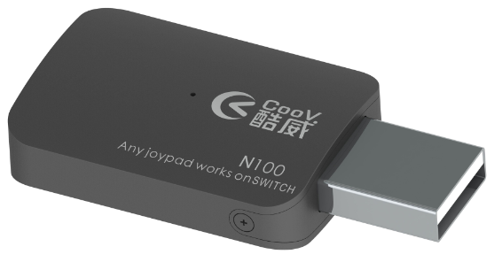

[TOC]

# 硬件介绍
N100是COOV转换器系列的基本形态，集成了一个USB A公与一个USB A母。可将互不兼容的主机与外设互相连接使用。


### 已支持主机
* NS主机
* PS4主机 *（3.0或更高版本固件）*
* Xbox One主机 *（3.0或更高版本固件）*

### 已支持外设
* NS Pro手柄
* PS4手柄及原装接收器
* Xbox One手柄
* PS3手柄 *（连接PS3手柄后，可能需要先多按几次PS键）*
* XBOX360有线手柄
* 其他第三方兼容手柄
* 键鼠、PC手柄、PC格斗摇杆等HID外设 *（配合 [K4](K4.html)）*

# 功能介绍
### 固件更新
N100通过模拟U盘的方式进行固件更新，新固件可以在[官网](http://www.mycoov.com/)、QQ群(486965394)、[Wiki](https://gamepad-converter.github.io/)中获得。用户下载新版本固件压缩包后，将其中的`firmware.bin`复制到N100 U盘中，选择覆盖即可。更新成功后，N100绿灯亮起，并自动重新连接电脑。*（某些情况下，电脑会提示写入失败，但实际已完成更新）*
在最新出厂的N100上，我们在U盘中增加了`info.txt`文档，用户可以很方便的从中获取版本信息，如下：
```
Prodect:N100                  
Prodect ID:D0152900           
Version:3.1                   
```

### 配置更新
在模拟U盘中，还有一个`data.bin`文件，这个文件存储着所有用户自定义参数。出厂状态下所有参数为默认值，当用户进入高级功能进行配置后，相关配置会被保存与此文件中。

用户可以刷入官方提供的各种配置文件来快速提升操控体验，也可以将自己的配置文件分享给其他转换器用户。

### 基本转换功能
[链接](../软件功能/converter_basic.html)
### 高级转换功能
[链接](../软件功能/converter_advanced.html)
### 连接NS主机
1. 掌机模式：
  1. 准备Type-C OTG转接头或线材
  2. 将NS主机、OTG转接头或线材、N100及手柄依次连接
  3. 若非1.x版本固件，还需将NS主机中`Pro Controller Wired Communication`选项置为`ON`
2. 底座模式：
  1. 将底座、N100及手柄依次连接
  2. 若非1.x版本固件，还需将NS主机中`Pro Controller Wired Communication`选项置为`ON`

### 连接PS4主机
1. 更新N100固件至3.x或更高版本
2. 准备一个USB HUB和一个PS4 **原装** 引导手柄
3. 把HUB连接到N100母口，再把引导手柄连接到HUB上
4. 把其他想转换的手柄连接到HUB上
5. 把N100连接至PS4主机 *（较早版本N100无法直接插入PS4主机，可以按照以下方法解决）*
    * 方法一：使用USB A公转A母延长线
    * 方法二：准备一把小号十字螺丝刀，卸掉N100两侧的螺丝，然后取下USB公头一侧的小挡板，将挡板旋转180°，再套入USB公头并卡紧，上螺丝。

### 连接Xbox One主机
1. 更新N100固件至3.x或更高版本
2. 准备一个USB HUB和一个Xbox ONE **原装** 引导手柄
3. 把HUB连接到N100母口，再把引导手柄连接到HUB上
4. 把其他想转换的手柄连接到HUB上
5. 把N100连接至Xbox ONE主机

# 其他信息
### 如何快速确认手柄是否被支持
* 尝试进入[高级功能](../软件功能/converter_advanced.html)，观察手柄是否会震动已经N100指示灯是否有反应。比如：同时按下`Home`+`中左`键，进入震动强度调整功能，再按几下方向键上和方向键下，如果手柄被支持，此时该手柄会震动，N100指示灯会闪烁。
### 如何恢复出厂设置
* 如无特殊需求，建议直接下载最新固件，并刷入其中的`firmware.bin`和`data.bin（出厂版）`

# 固件
### 下载
* [V1.6](N100/COOV N100 V1.6 20171201.zip)
* [V2.4](N100/COOV N100 V2.4 20170909.zip)
* [V3.2](N100/COOV N100 V3.2 20171205.zip)
### 变更日志
```
2017年11月30日（V3.1）
1. 支持XBOX ONE主机，需配合原装手柄引导
2. 支持PS4主机，需配合原装手柄引导
3. 支持连接键盘、鼠标、HID手柄、HID格斗摇杆操控，需配合COOV HUB K4
4. NS模式摇杆顺滑及平整性优化
5. 多个手柄连接状态下的优化
6. 支持将手柄按键映射到摇杆上

2017年9月9日（V2.04）：
1. 稳定性修复，解决异常触发的问题
2. 支持同时接入多个转换器
3. 支持接入PRO手柄
4. 支持Mad Catz PS4手柄及PS4无线接收器
5. 默认状态下的震动强度调整为低，而非关闭

2017年8月20日：
1. 扳机键连发及映射功能修复
2. 2.x版本配置模式震动提示修复
3. 增加震动开关及力度调整功能

2017年8月15日：
1. 震动功能稳定性修复
2. 摇杆优化

2017年8月10日：
1. 支持震动
2. 支持体感（仅限连接PS4手柄）
3. 支持部分带有主机自动识别功能的手柄，比如BTP-BD2E
4. 震动功能稳定性修复

注意：请将"Pro Controller Wired Communication" 设置为ON

2017年8月2日：
1. 增加摇杆校准功能
2. 增加一款盗版PS4手柄的支持

2017年7月21日：
1. 增加对Xbox one精英版手柄的支持
2. 增加针对摇杆反弹抖动的过滤机制
```
