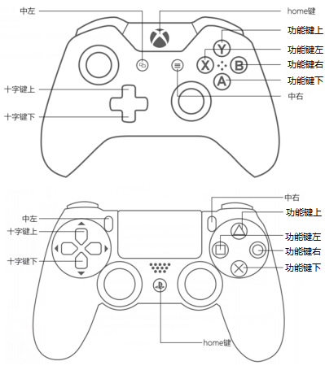
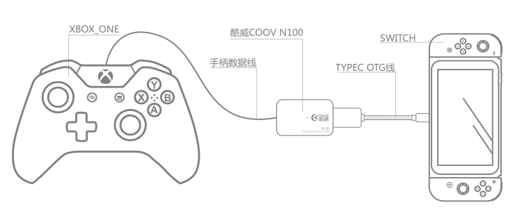

[TOC]

# **硬件介绍**
N100是COOV转换器系列的基本形态，集成了一个USB A公与一个USB A母。可将互不兼容的主机与外设互相连接使用。


### **键位描述图**


### **已支持主机**
* NS主机
* PS4主机 *（3.0或更高版本固件）*
* Xbox One主机 *（3.0或更高版本固件）*

### **已支持外设**
* NS Pro手柄
* PS4手柄及原装接收器
* Xbox One手柄
* PS3手柄 *（连接PS3手柄后，可能需要先多按几次PS键）*
* XBOX360有线手柄
* 其他第三方兼容手柄
* 键鼠、PC手柄、PC格斗摇杆等HID外设 *（配合 [K4](K4.html)）*

# **快速上手**
### **N100 NS主机客厅模式**
SWITCH主机放置在底座情形下，将N100插入SWITCH底座USB口，其他手柄通过USB线连入N100末端即可正常工作。


### **N100 NS主机移动模式**
将Type-C OTG线插入SWITCH充电口，N100插入此TYPEC线末端，其他手柄通过USB线连入N100末端即可正常工作。


### **N100 PS4主机**
首先将N100更新至最新固件，将PS4原装手柄连入N100末端，N100插入PS4主机。若想使用其他外设，请配合HUB。

### **N100 Xbox One主机**
首先将N100更新至最新固件，将Xbox One原装手柄连入N100末端，N100插入Xbox One主机。若想使用其他外设，请配合HUB。

# **功能介绍**
### **固件更新**
N100通过模拟U盘的方式进行固件更新，新固件可以在[官网](http://www.mycoov.com/)、QQ群(486965394)、[Wiki](https://gamepad-converter.github.io/)中获得。用户下载新版本固件压缩包后，将其中的`firmware.bin`复制到N100 U盘中，选择覆盖即可。更新成功后，N100绿灯亮起，并自动重新连接电脑。*（某些情况下，电脑会提示写入失败，但实际已完成更新）*
在最新出厂的N100上，我们在U盘中增加了`info.txt`文档，用户可以很方便的从中获取版本信息，如下：
```
Prodect:N100                  
Prodect ID:D0152900           
Version:3.1                   
```

### **配置更新**
在模拟U盘中，还有一个`data.bin`文件，这个文件存储着所有用户自定义参数。出厂状态下所有参数为默认值，当用户进入高级功能进行配置后，相关配置会被保存与此文件中。

用户可以刷入官方提供的各种配置文件来快速提升操控体验，也可以将自己的配置文件分享给其他转换器用户。

### **连接NS主机**
1. 掌机模式：
  1. 准备Type-C OTG转接头或线材
  2. 将NS主机、OTG转接头或线材、N100及手柄依次连接
  3. 若非1.x版本固件，还需将NS主机中`Pro Controller Wired Communication`选项置为`ON`
2. 底座模式：
  1. 将底座、N100及手柄依次连接
  2. 若非1.x版本固件，还需将NS主机中`Pro Controller Wired Communication`选项置为`ON`

### **连接PS4主机**
1. 更新N100固件至3.x或更高版本
2. 准备一个USB HUB和一个PS4 **原装** 引导手柄
3. 把HUB连接到N100母口，再把引导手柄连接到HUB上
4. 把其他想转换的手柄连接到HUB上
5. 把N100连接至PS4主机 *（较早版本N100无法直接插入PS4主机，可以按照以下方法解决）*
    * 方法一：使用USB A公转A母延长线
    * 方法二：准备一把小号十字螺丝刀，卸掉N100两侧的螺丝，然后取下USB公头一侧的小挡板，将挡板旋转180°，再套入USB公头并卡紧，上螺丝。

### **连接Xbox One主机**
1. 更新N100固件至3.x或更高版本
2. 准备一个USB HUB和一个Xbox ONE **原装** 引导手柄
3. 把HUB连接到N100母口，再把引导手柄连接到HUB上
4. 把其他想转换的手柄连接到HUB上
5. 把N100连接至Xbox ONE主机

# **高级转换功能**
### **线性控制（默认开启）**
线性控制是用来关闭或开启手柄摇杆和扳机的线性响应，以实现更短的键程和更快的响应速度

##### **关闭线性**
1. 同时按下`HOME` + `下键`并松开，进入线性控制功能配置模式
2. 按住需要关闭线性功能的扳机，或拨动需要关闭线性功能的摇杆，再按一下`中左键`，即可关闭对应扳机或摇杆的线性功能
3. 按一下`HOME`键，退出配置模式

##### **开启线性**
1. 同时按下`HOME` + `下键`并松开，进入线性控制功能配置模式
2. 按住需要开启线性功能的扳机，或拨动需要开启线性功能的摇杆，再按一下`中右键`，即可开启对应扳机或摇杆的线性功能
3. 按一下`HOME`键，退出配置模式

##### **开启所有键位的线性**
1. 同时按下`HOME` + `下键`并松开，进入线性控制功能配置模式
2. 按住`HOME`键3秒钟，会自动开启所有线性功能，并自动退出配置模式

##### **支持的键位**
两个摇杆及两个扳机

### **键位映射**
键位映射是将一个按键映射到另一个不同按键上，可实现多个按键相同功能或多个按键相互交换的功能。

##### **设置**
1. 同时按下`HOME` + `右键`并松开，进入键位映射功能配置模式
2. 按一下需要映射的按键
3. 按一下目标映射的按键
4. 按一下`HOME`键，退出配置模式
比如先按`左键`，再按`右键`，即使得`左键`具有`右键`功能。

##### **单个清除**
 *（固件版本不小于 V3.4002）*
1. 同时按下`HOME` + `右键`并松开，进入键位映射功能配置模式
2. 按一下需要清除映射的按键
3. 再按一下需要清除映射的按键
4. 按一下`HOME`键，退出配置模式
比如先按`左键`，再按`右键`，即使得`左键`具有`右键`功能。

##### **全部清除**
1. 同时按下`HOME` + `右键`并松开，进入键位映射功能配置模式
2. 按住`HOME`键3秒钟，会自动清除所有已配置的键位映射，并自动退出配置模式

##### **实例**
1. 先将`左键`映射为`右键`，再将`右键`映射为`左键`，即可实现两键交换（在键位映射模式下，实现方法为按`左键` `右键` `右键` `左键`）
2. 将`左键`映射为`右键`，再将`右键`映射为`下键`，再将`下键`映射为`左键`，即可实现三键交换 （在键位映射模式下，实现方法为按`左键` `右键` `右键` `下键` `下键` `左键`）
3. 以此类推

##### **支持的键位**
* 基本模式：除`HOME`键及`摇杆`外的所有按键
* 配合K4 HUB：可以将HID外设映射到手柄上。详情仅访问[K4](K4.html)

### **连发（默认关闭）**
连发控制是用来将选定的按键配置为连发模式，当按键处于连发模式下，该键被按下后，就会以一定频率模拟按下-松开-按下-松开事件，连发频率可调

##### **开启连发**
1. 同时按下`HOME` + `左键`并松开，进入连发功能配置模式
2. 按住需要开启连发功能的按键，再按一下`中右键`，即可开启对应按键的连发功能
3. 按一下HOME 键，退出配置模式

##### **关闭连发**
1. 同时按下`HOME` + `左键`并松开，进入连发功能配置模式
2. 按住需要关闭连发功能的按键，再按一下`中左键`，即可关闭对应按键的连发功能
3. 按一下HOME 键，退出配置模式

##### **清除所有连发**
1. 同时按下`HOME` + `左键`并松开，进入连发功能配置模式
2. 按住`HOME`3秒钟，会自动清除所有已配置的连发功能，并自动退出配置模式

##### **调整连发频率**
1. 同时按下`HOME` + `左键`并松开，进入连发功能配置模式
2. 按一下`十字方向键上`，即可加大连发频率
3. 按一下`十字方向键下`，即可降低连发频率
4. 按一下`HOME`键，退出配置模式

##### **支持的键位**
除`HOME`、`中左键`、`中右键`及摇杆外的所有按键

### **一键连招**
在格斗游戏中，往往一个大招需要按照一定规律连续操作手柄。一键连招功能可以将这个连招动作记录下来，并设置成通过某个按键触发，设置完成后，玩家即可一键连招

##### **设置**
1. 同时按下`HOME`+`上键`并松开，进入一键连招功能配置模式
2. 进行连招操作，设备会自动将连招记录（最多记录5组连招，每组连招至少可记录5秒，且此操作不会被屏蔽）
3. 按一下`HOME`键，结束录制
4. 按一下用于触发此连招的按键。设置成功后，会自动退出配置模式（也可以通过再按一次`HOME`键退出）

##### **单个清除**
 *（V3.4及之前版本，存在BUG，无法单个清除，请更新最新固件）*
1. 同时按下`HOME`+`上键`并松开，进入一键连招功能配置模式
2. 按一下`HOME`键，不进行录制
3. 按一下之前配置成触发连招的按键。清除成功后，会自动退出配置模式（也可以通过再按一次`HOME`键退出）

##### **全部清除**
1. 同时按下`HOME`+`上键`并松开，进入一键连招功能配置模式
2. 按住`HOME`键3秒钟，会自动清除所有已配置的一键连招，并自动退出配置模式

##### **支持的键位**
* 基本模式：除`HOME`键及`摇杆`外的所有按键
* 配合K4 HUB：可以用键鼠按键触发连招。详情仅访问[K4](K4.html)

### **手柄震动开关及力度调整功能**
1. 同时按下`HOME`键 + `中左键`并松开，进入震动配置模式
2. 按一下`十字方向键上`，提高震动力度
3. 按一下`十字方向键下`，降低震动力度（降到最低即关闭震动）
4. 按一下`HOME`键，退出配置模式

*DS3手柄无法调整震动强度，只有开关功能*


### **校准功能**

##### **校准**
校准功能，可以在不增大死区的前提下，解决部分手柄出现的摇杆漂移问题。
1. 同时按下`HOME` + `中右键`并松开，进入校准配置模式
2. 尝试转动两个摇杆，直到手柄停止震动
3. 停止震动后，先松开两个摇杆，再按一下`HOME`键
4. 等待1秒后，自动退出校准模式，转换器亮绿灯表示校准成功，红灯表示校准失败

##### **清除校准数据**
1. 同时按下`HOME` + `中右键`并松开，进入校准配置模式
2. 按下`HOME`键并保持3秒，会清除所有校准参数，并退出配置模式

##### **使用建议**
大部分原装手柄无需校准，如果出现摇杆漂移，再进行校准。

### **其他事项**
1. 在高级功能配置过程中，每次有效操作都会触发一次手柄震动
2. 连发频率调整将以红色LED灯闪烁频率予以提示
3. 默认通过双击`HOME`键实现对`Capture`（NS手柄）、`触摸板`（DS4手柄）的模拟
4. 在使用V2.00以上版本，请将"Pro Controller Wired Communication" 设置为 ON

# **其他信息**
### **如何快速确认手柄是否被支持**
* 尝试进入[高级功能](../软件功能/converter_advanced.html)，观察手柄是否会震动已经N100指示灯是否有反应。比如：同时按下`Home`+`中左`键，进入震动强度调整功能，再按几下方向键上和方向键下，如果手柄被支持，此时该手柄会震动，N100指示灯会闪烁。
### **如何恢复出厂设置**
* 如无特殊需求，建议直接下载最新固件，并刷入其中的`firmware.bin`和`data.bin（出厂版）`

# **固件**
### **下载**
* [V3.4002](N100/COOV N100 & N200 V3.4002 20171226.zip)
* [V3.4](N100/COOV N100 & N200 V3.4 20171212.zip)
* [V3.2](N100/COOV N100 V3.2 20171205.zip)
* [V2.4](N100/COOV N100 V2.4 20170909.zip)
* [V1.6](N100/COOV N100 V1.6 20171201.zip)
### **变更日志**
```
2017年12月12日（V3.4）
1. 在按键映射配置过程中，过滤掉鼠标移动误触
2. PRO手柄的支持优化，主要解决一些输入冲突
3. 修复XB1手柄 LT RT数据异常的情况
4. 修复一键连招中触发键与连招干涉的问题
5. 修复一个数据处理逻辑问题

2017年12月8日（V3.3）
1. 修复X1主机下LT/RT异常
2. 修复X1主机下震动异常

2017年11月30日（V3.1）
1. 支持XBOX ONE主机，需配合原装手柄引导
2. 支持PS4主机，需配合原装手柄引导
3. 支持连接键盘、鼠标、HID手柄、HID格斗摇杆操控，需配合COOV HUB K4
4. NS模式摇杆顺滑及平整性优化
5. 多个手柄连接状态下的优化
6. 支持将手柄按键映射到摇杆上

2017年9月9日（V2.04）：
1. 稳定性修复，解决异常触发的问题
2. 支持同时接入多个转换器
3. 支持接入PRO手柄
4. 支持Mad Catz PS4手柄及PS4无线接收器
5. 默认状态下的震动强度调整为低，而非关闭

2017年8月20日：
1. 扳机键连发及映射功能修复
2. 2.x版本配置模式震动提示修复
3. 增加震动开关及力度调整功能

2017年8月15日：
1. 震动功能稳定性修复
2. 摇杆优化

2017年8月10日：
1. 支持震动
2. 支持体感（仅限连接PS4手柄）
3. 支持部分带有主机自动识别功能的手柄，比如BTP-BD2E
4. 震动功能稳定性修复

注意：请将"Pro Controller Wired Communication" 设置为ON

2017年8月2日：
1. 增加摇杆校准功能
2. 增加一款盗版PS4手柄的支持

2017年7月21日：
1. 增加对Xbox one精英版手柄的支持
2. 增加针对摇杆反弹抖动的过滤机制
```
